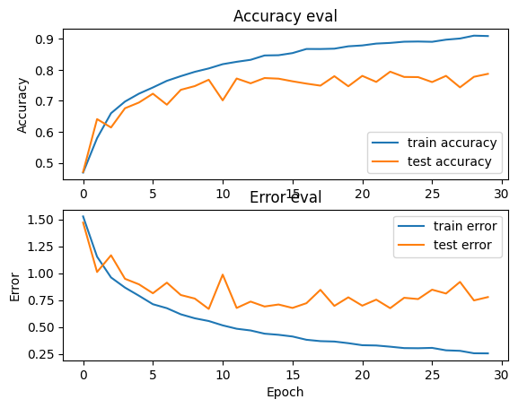

# 🎵 Music Genre Classification using CNN and MFCC Features


## 📌 Project Overview

This project aims to classify audio files into one of 10 music genres using deep learning techniques. Leveraging the [GTZAN Music Genre Dataset](https://www.kaggle.com/datasets/andradaolteanu/gtzan-dataset-music-genre-classification/data), we apply feature extraction techniques (MFCC) and train a Convolutional Neural Network (CNN) to accurately identify the genre of unseen audio samples.

---

## Result



---

## 🎯 Problem Statement

Classify 30-second `.wav` audio clips into one of the following 10 genres:

* 🎸 Blues
* 🎼 Classical
* 🤠 Country
* 💃 Disco
* 🎤 HipHop
* 🎷 Jazz
* 🤘 Metal
* 🎧 Pop
* 🇯🇲 Reggae
* 🎸 Rock

---

## 📁 Dataset

* **Source**: [GTZAN Music Genre Dataset](https://www.kaggle.com/datasets/andradaolteanu/gtzan-dataset-music-genre-classification/data)
* **Format**: WAV files (30 seconds each)
* **Classes**: 10 genres
* **Total Files**: 1000 (100 per genre)

---

## 🧠 Technologies & Tools Used

| Category          | Libraries/Tools                       |
| ----------------- | ------------------------------------- |
| Programming       | Python                                |
| Audio Processing  | `librosa`, `numpy`                    |
| Modeling          | `TensorFlow`, `Keras`, `Scikit-learn` |
| Visualization     | `matplotlib`                          |
| Model Persistence | `pickle`                              |

---

## 🔍 Approach

### 1. **Preprocessing**

* Sample rate standardized to 22,050 Hz.
* Audio files trimmed to 29 seconds.
* Each audio file is sliced into 10 segments.
* Extracted MFCC (Mel-Frequency Cepstral Coefficients) features with 13 coefficients per slice.

### 2. **Data Augmentation**

* Slicing each audio into smaller frames creates more training examples, increasing dataset size 10x.

### 3. **Model Architecture**

A simple but effective CNN with the following architecture:

```
Conv2D ➝ MaxPooling ➝ BatchNorm ➝ Conv2D ➝ MaxPooling ➝ BatchNorm ➝ Conv2D ➝ MaxPooling ➝ BatchNorm ➝ Dropout ➝ Flatten ➝ Dense ➝ Output
```

| Metric        | Value                           |
| ------------- | ------------------------------- |
| Epochs        | 30                              |
| Batch Size    | 32                              |
| Optimizer     | RMSProp                         |
| Loss Function | Sparse Categorical Crossentropy |

---

## 📊 Model Performance

| Metric              | Value   |
| ------------------- | ------- |
| Training Accuracy   | \~91%   |
| Validation Accuracy | \~78.7% |
| Loss                | \~0.24  |

The model performs consistently well across training and validation, demonstrating strong generalization.

---

## ✅ Future Improvements

* Use Mel Spectrograms or Chroma Features
* Try more complex models (ResNet, CRNN)
* Implement audio augmentation (pitch shift, time stretch)
* Deploy as a web app for real-time genre classification


---
