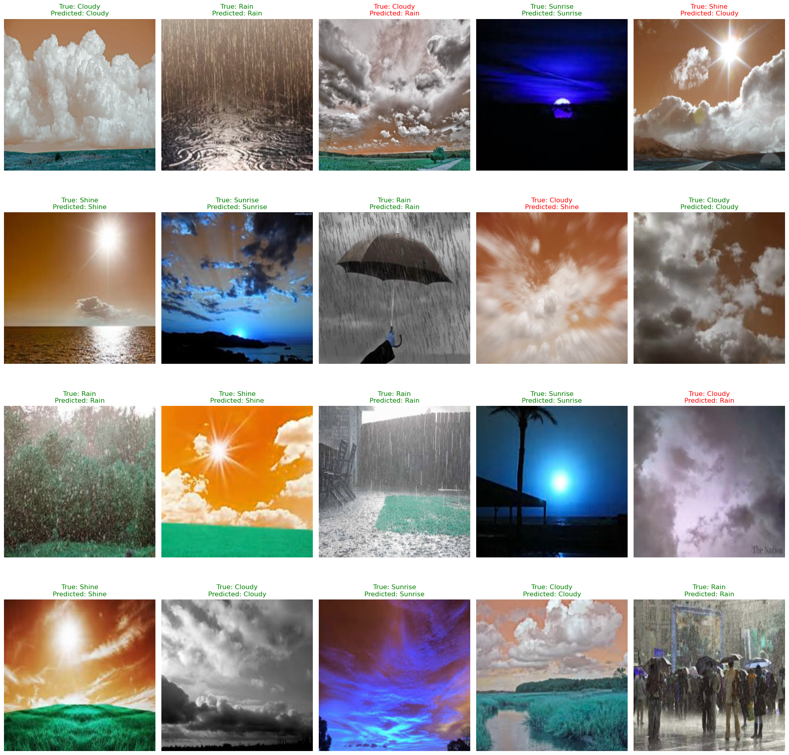

# 🌦️ Weather Classification using Deep Learning

This project focuses on classifying weather conditions from images into four categories — **Sunrise, Shine, Rain, and Cloudy** — using both custom Convolutional Neural Networks (CNNs) and popular pre-trained models (VGG16, ResNet50, and MobileNetV2). The primary goal is to build and compare deep learning models for real-world weather classification tasks.

---

## Sample Model; predictions



---

## 📁 Dataset

- **Source**: [Mendeley Weather Image Dataset](https://data.mendeley.com/datasets/4drtyfjtfy/1)
- **Classes**:
    | Weather Class | Number of Images |
    |---------------|------------------|
    | Sunrise       | 357              |
    | Shine         | 253              |
    | Rain          | 215              |
    | Cloudy        | 300              |

## 🔧 Technologies Used

- Python
- TensorFlow / Keras
- OpenCV
- NumPy / Pandas
- Matplotlib / Seaborn
- scikit-learn

---

## 🚀 Project Workflow

### 1. 📂 Data Loading & Preprocessing
- Loaded images from subdirectories based on class names.
- Resized to `(224x224)` and normalized pixel values.
- One-hot encoded labels.
- Visualized class distribution and sample images.

### 2. 🧠 Model Building
- Custom CNN Model
- Transfer Learning Models:
  - VGG16
  - ResNet50
  - MobileNetV2

### 3. 📊 Evaluation Metrics
- Accuracy
- Precision, Recall, F1-score
- Confusion Matrix
- Visualization of correct and incorrect predictions

---

## 📈 Results

| Model         | Accuracy |
|---------------|----------|
| VGG16         | 95.11%   |
| CNN (Custom)  | 92.44%   |
| MobileNetV2   | 92.44%   |
| ResNet50      | 58.22%   |

> ✅ **VGG16** achieved the highest accuracy and F1-score, making it the most reliable model for deployment.

---

## 📷 Sample Predictions

Included visual comparison of true and predicted labels, highlighting misclassified cases in red.

---

## 🔍 Confusion Matrices

Generated and visualized confusion matrices for each model to assess class-wise performance.

---

## 📌 Future Improvements

- Add real-time prediction using webcam or uploaded image.
- Deploy the model using Streamlit or Flask.
- Use data augmentation to improve generalization.
- Hyperparameter tuning and ensemble modeling.

---

## 🧪 How to Run

```bash
# Clone this repository
git clone https://github.com/your-username/weather-classification-dl.git
cd weather-classification-dl

# (Optional) Create a virtual environment
python -m venv venv
source venv/bin/activate  # or venv\Scripts\activate on Windows

# Install dependencies
pip install -r requirements.txt

# Run the notebook
jupyter notebook Weather_Classification.ipynb

